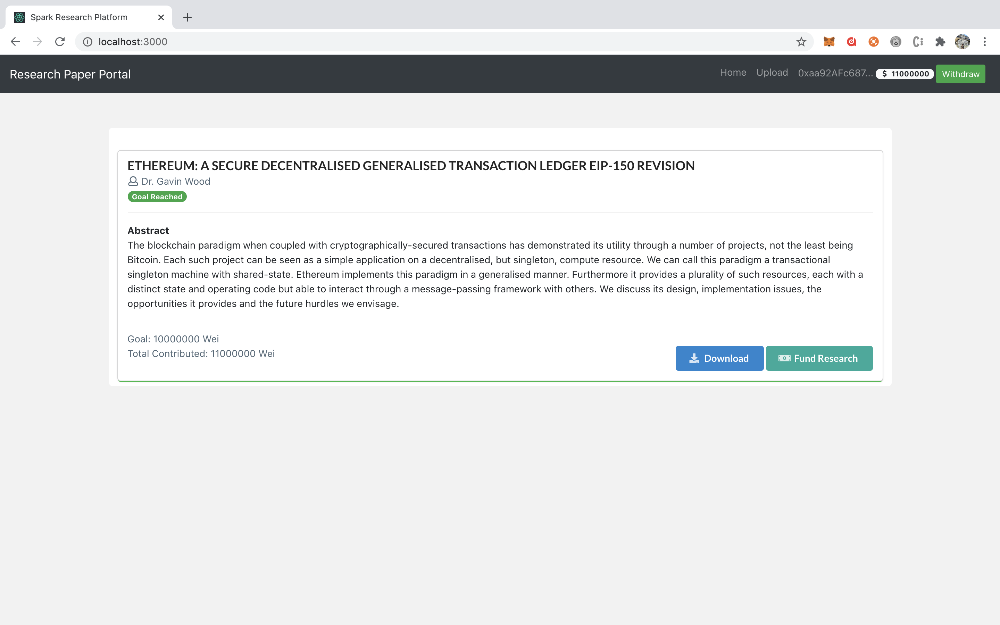
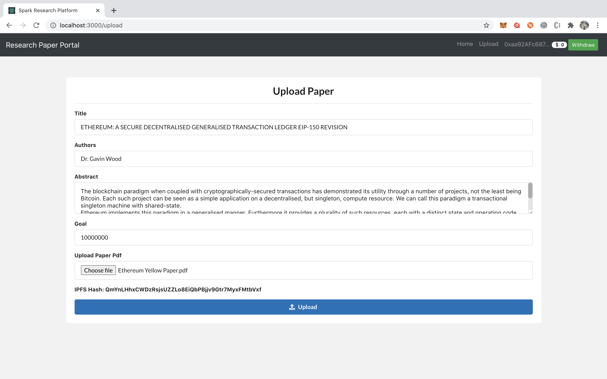
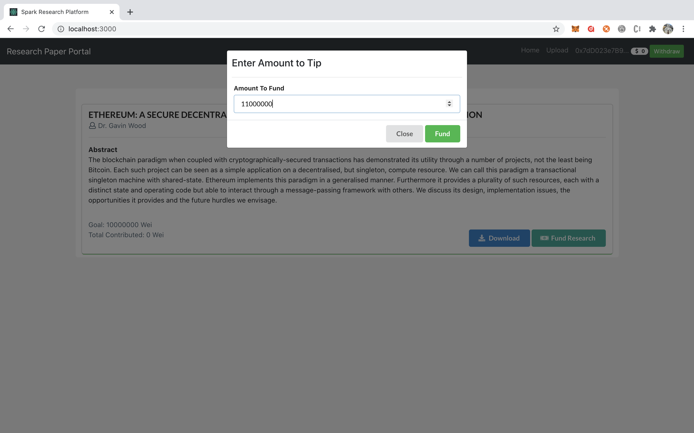

# Research Paper repository using Filecoin [Spark Hackathon]

[](https://travis-ci.org/joemccann/dillinger)

Ongong technological Research is a very essential component of today's world. The research conferences and repositories in today's world are completely centralised. Research papers and other resources are not freely available to everyone which should not be the case in today's decentralised world. Easy access of these resources also enables more people to read quality content and therefore contribute more in research. 

To tackle this problem we have created a decentralised repository of research papers which will be available for reading and downloading for free for everyone. The papers will be stored in pdf format in decentralised storage IPFS and the details of the paper are stored in an smart contract on the blockchain which can be used in case of disputes. Also there is an in built crowdsourcing functionality for acquiring grants for further research.

## Why Filecoin? 

Filecoin is a decentralised storage platform which is perfect for our use case. It is decentralised, have in-built verification mechanisms, no one controls the access to the platform and anyone can easily upload/download from the storage. This way we can easily create an open community of researchers without relying on a centralised third party. 

<br />

<br />
<br />

Anyone can upload the research paper entering relevant information like name, abstract, authors, etc which will be stored in a smart contract on the ethereum blockchain. 

<br />

<br />
<br />

At the same time, the person uploading the paper can also ask the community for grants for further research in that area. Everyone can easily give his contribution using preferred wallet.

<br /><br />

<br /><br />

In this way, the research output of the community as a whole will increase and more people will be able to enter the field because of availability of quality content for free.


We also have a video demo [here.](https://youtu.be/ryuxdeZkeqY)

Here are the steps for installation and testing the project - 

# Installation

```sh
$ git clone https://github.com/sarangparikh22/research-app-filecoin.git
$ cd research-app-filecoin
$ cd client
$ npm install
````
# Deploying Contract and Seting up 
```sh
$ cd ..
$ truffle migrate --reset --network develop
```

# Serving the Application

Set up a Powergate node using instructions [here.](https://docs.filecoin.io/build/examples/simple-pinning-service/step-1-powergate-setup/#requirements) With the powergate instance running, follow these steps:

```sh
$ cd client
$ npm start
```

And that's it we are good to go. Please feel free to reach out to us with any improvements.


## Contributors 
The project is created by - 
- [Riya Singh](https://in.linkedin.com/in/riya-singh-5aa773193)
- [Sarang Parikh](https://in.linkedin.com/in/sarang-parikh)
- [Akash](https://in.linkedin.com/in/akash981)